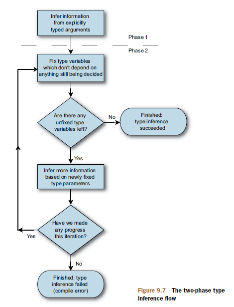

In many cases, the resulting code can be read aloud and understood immediately


## Type inference

Type inference is handled so smoothly and naturally that we often time take it granted as how hard the compiler has to work out types on our behalf, all for the sake of making our code clearer and more concise.

I feel sorry that I have failed the C# designers when I write sloppy code which often the case.


Let's imagine a world without type inference:

```
public static List<TSource> ToList<TSource>(this IEnumerable<TSource> source)

accounts.ToList<AccountEntity>();
```

This isn't too bad, only one type to write out. But it gets worse:

```
var ints1 = new int[3];
ints1[0] = 4;
ints1[1] = 3;
ints1[2] = 0;

var ints2 = new int[3];
ints2[0] = 5;
ints2[1] = 4;
ints2[2] = 2;

var result = ints1.Join<int, int, int, int>(ints2,
    x => x + 1,
    y => y,
    (x, y) => x);
```

You have to write four same type and it really gets in the way of the main operation. But it gets worse:

```
var animals = new Animal[]
{
    new Animal{ID = 0, Breed = "cat"},
    new Animal{ID = 10, Breed = "dog"}
};

var medications = new Medication[]
{
    new Medication{ID = 10, Type = "antibiotic"},
    new Medication{ID = 0, Type = "sedative"},
    new Medication{ID = 0, Type = "antihistimine"}
};

var query = animals.Join<Animal, Medication, int, 'a>(medications,
        a => a.ID,
        m => m.ID,
        (a, m) => new { a.Breed, m.Type });
```

Wait a sec, what is 'a ? It is an anonymous type. Code above won't even compile. The only way to compile it is to remove the implicit types let the compile do the hard work figuring out types. 

Before we drill into the two-phase type inference process, we need to understand how return type inference and array type inference work.

Inferred array type
```
var names = new string[] {"Holly", "Jon", "Tom", "Robin", "William"};
```
Because all the items are string so we can omit type
```
var names = new[] {"Holly", "Jon", "Tom", "Robin", "William"};
```
But what if we have mixed types
```
// a is object[]
var a = new[] { new MemoryStream(), new StringWriter(), new object() };
```
The compile will try to work out one type that all other types can convert to then that type will be the overall type of the array. 

Inferred return type 
```
delegate T MyFunc<T>();

static void WriteResult<T>(MyFunc<T> function)
{
    Console.WriteLine(function());
}

WriteResult(delegate
{
    if (DateTime.Now.Hour < 12)
    {
        return 10;
    }
    else
    {
        return new object();
    }
});
```
The compiler forms a set of all the types from the return statements in the body of the anonymous function and checks to see if exactly one of the types can be implicitly converted to from all the others.

The two main points
* method arguments work as a team
* type inference is performed in two phases

Two phases 

1.  Infer type from typed arguments, anonymous functions that have implicitly typed params

2. Implicitly typed lambda expressions and method groups have their types inferred. The idea is to see whether any of the information the compiler has pieced together so far is enough to work out the parameter types of the lambda expression (or method group). If it is, the compiler can then
examine the body of the lambda expression and work out the inferred return type which is often another of the type parameters it’s looking for. If the second phase gives some more information, the compiler goes through it again, repeating until either it runs out of clues or it’s worked out all the type parameters involved.

    

**At this point, I don't know what to say but appreciate the effort that C# designers have put in**


## Extension methods
>Like implicit typing of local variables, extension methods are controversial. It’d be difficult
to claim that they make the overall aim of the code harder to understand in
many cases, but at the same time they do obscure the details of which method is getting
called. In the words of one of the lecturers at my university, “I’m hiding the truth
in order to show you a bigger truth.” If you believe that the most important aspect of
the code is its result, extension methods are great. If the implementation is more
important to you, then explicitly calling a static method is more clear. Effectively, it’s
the difference between the what and the how.

